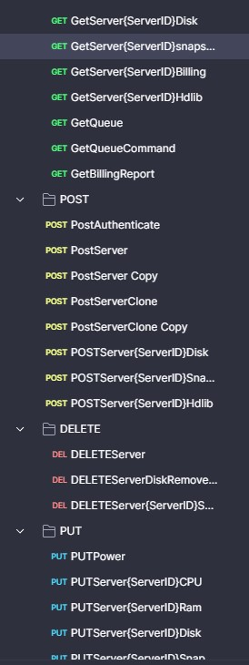

# WarCrew Automated Tool

WarCrew Automated Tool is a comprehensive Python application designed to automate various server management tasks using RESTful API calls. This tool supports creating, cloning, and listing servers, managing server power states, monitoring process statuses, and more.

## Features

- **Create Servers:** Easily create new servers with custom specifications.
- **Clone Servers:** Clone existing servers with user-defined configurations.
- **List Servers:** Retrieve and display a list of all available servers.
- **Server Management:** Power on/off servers and get detailed server information.
- **Queue Monitoring:** Check the status of server provisioning and cloning queues.
- **User Input Validation:** Robust user input validation for server creation and cloning.
- **Notes Management:** Keep track of actions performed with a built-in notes system.
